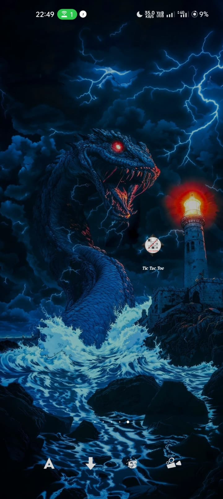
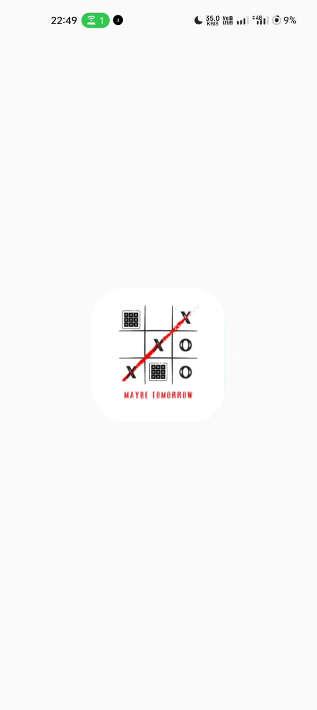
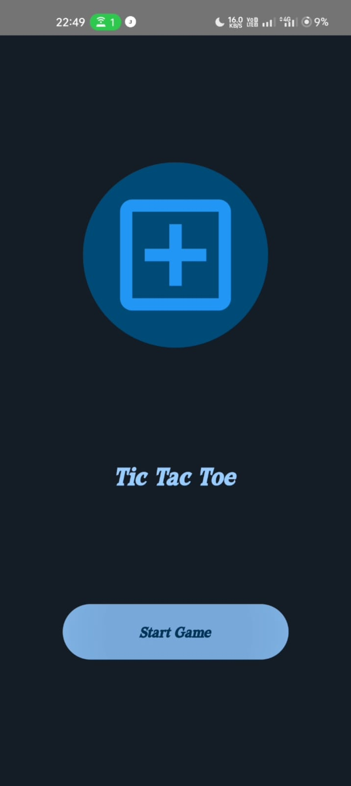
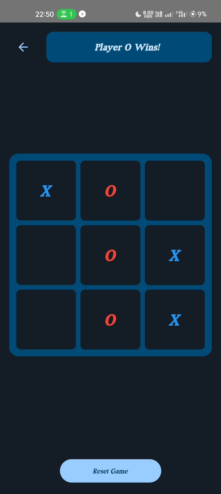

# Tic Tac Toe Android Game

A modern implementation of the classic Tic Tac Toe game built with Jetpack Compose for Android, featuring an unbeatable AI opponent.

## Features

- Beautiful Material 3 Design UI
- Smooth animations and transitions
- Sound effects and haptic feedback
- Portrait mode gameplay
- Two-player local multiplayer
- Single player vs AI mode with perfect strategy
- Unbeatable AI using Minimax algorithm with alpha-beta pruning
- Strategic AI opening moves and position control

## Game Modes

### Single Player vs AI
- Challenge yourself against an unbeatable AI opponent
- AI uses perfect strategy with Minimax algorithm
- Multiple difficulty patterns through strategic positioning
- Instant feedback and smooth animations

### Two Player Local
- Play against a friend on the same device
- Turn-based gameplay with clear indicators
- Victory and draw detection

## Technical Details

- Built with Kotlin and Jetpack Compose
- Minimum SDK: 24 (Android 7.0)
- Target SDK: 34 (Android 14)
- Uses Material 3 theming
- Implements clean architecture principles
- Version: 4.0.0

### AI Implementation
- Minimax algorithm with alpha-beta pruning
- Strategic opening moves and position control
- Optimal move calculation and prediction
- Efficient board state evaluation

## Screenshots

  
  
  
  

## Getting Started

1. Clone the repository
2. Open the project in Android Studio
3. Build and run the app on your device or emulator

## Requirements

- Android Studio Hedgehog | 2023.1.1
- Kotlin 1.9.0
- Android Gradle Plugin 8.1.0

## Latest Updates (v4.0.0)

- Added unbeatable AI opponent using Minimax algorithm
- Implemented alpha-beta pruning for improved performance
- Added strategic opening moves and position control
- Enhanced UI feedback and game flow
- Improved sound effects and animations
- Bug fixes and performance improvements

## License

This project is licensed under the [MIT License](LICENSE).

Feel free to explore, use, and contribute to this project! 😊
